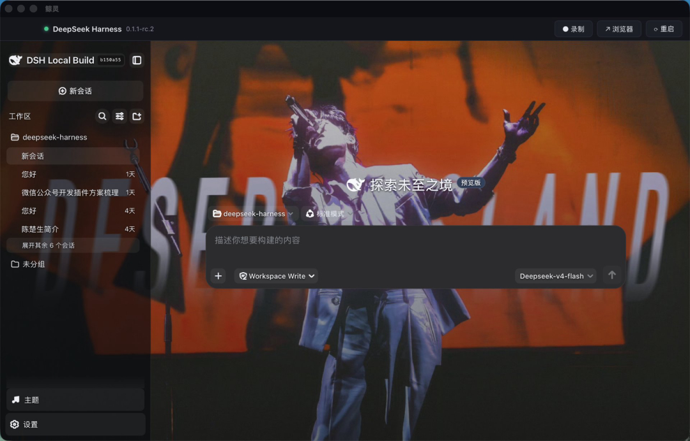
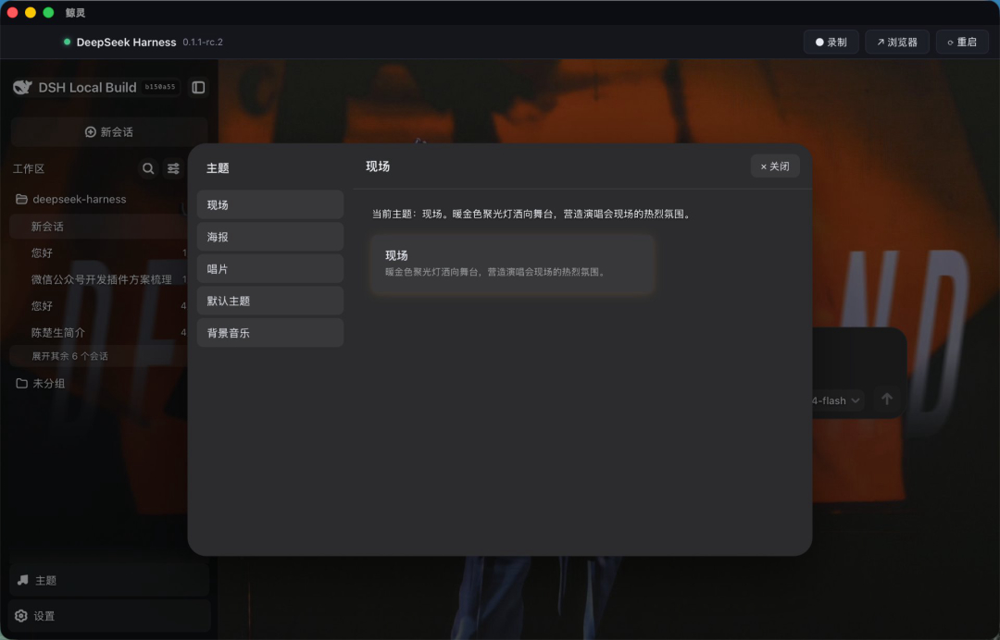
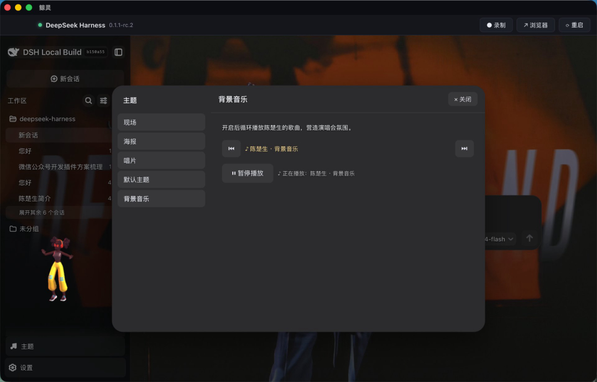

# DeepSeek Harness 桌面客户端

将 [DeepSeek Harness](https://github.com/DeepSeek-MAI/deepseek-harness)(简称 dsh)封装为原生桌面应用,让 dsh 的 Web UI 在独立窗口中运行,替代"在浏览器里打开页面"的使用方式。支持 **macOS / Linux / Windows** 三端。

技术栈:Tauri 2 + Rust + React + TypeScript + Vite。

## 鲸灵有什么不同

原 [DeepSeek Harness](https://github.com/DeepSeek-MAI/deepseek-harness) 需要通过浏览器访问 Web 页面,而**鲸灵把它变成本地原生桌面应用**,并在壳层做了浏览器做不到的增强:

| 能力 | 原 DeepSeek Harness | 鲸灵 |
| ---- | ---- | ---- |
| 启动方式 | 终端 `pnpm dev` / `dsh start`,再手动打开浏览器 | 双击应用自动检测、启动并内嵌 dsh Web UI |
| 操作入口 | 浏览器标签页,无全局快捷入口 | 顶栏常驻「录制 / 浏览器 / 重启」;托盘图标一键操作 |
| 屏幕录制 | 无 | 一键录制屏幕 + 麦克风 + 系统声音,自动保存到影片目录 |
| 主题与插件 | Web 页面支持 | 完整内嵌 dsh 插件生态,支持自定义主题、背景音乐、悬浮组件等 |
| 离线/本地体验 | 依赖浏览器环境 | 独立窗口,更像原生应用,不受浏览器标签干扰 |

一句话:**鲸灵 = DeepSeek Harness 的全部能力 + 原生桌面壳的快捷操作 + 屏幕录制 + 内嵌主题/插件生态**。

## 功能一览

| 模块 | 功能 |
| ---- | ---- |
| M1 桌面壳 | 顶栏快捷操作(录制 / 浏览器 / 重启 / 停止)、WebView 内嵌 dsh Web UI、dsh 自动检测与启动管理 |
| M2 系统集成 | 托盘图标与菜单、健康状态轮询(dsh-status 事件)、浏览器打开、日志查看 |
| M3 资源管理 | dsh 检测(PATH 优先,其次源码项目)、端口管理与状态上报、启动/停止/重启 |
| M4 屏幕录制 | 屏幕 + 麦克风 + 系统声音(BlackHole)录制,ffmpeg 编码,自动保存到影片目录 |

## 界面预览

### 主界面（陈楚生主题）

顶栏提供「录制」「浏览器」「重启」快捷入口,内嵌 dsh Web UI 完整保留原有功能,并支持自定义主题。



### 主题切换

左侧切换「现场 / 海报 / 唱片 / 默认主题」,右侧实时预览主题说明。一键换肤,沉浸感更强。



### 背景音乐

支持为当前主题配置循环背景音乐;播放器可暂停/切歌,左下角还有随主题风格变化的悬浮小助手。



### 其他状态

- 未检测到 dsh:显示启动引导界面,提供「启动 / 安装内置运行时」入口。
- 录制中:顶栏「录制」按钮变红并显示时长,再次点击停止并自动打开录制文件夹。

## 系统要求

- macOS 12+ / Linux / Windows 10+
- [Node.js](https://nodejs.org) 18+ 与 [pnpm](https://pnpm.io)
- [Rust](https://rustup.rs) 1.75+(Tauri 2 要求)
- 系统平台对应的编译工具链(Tauri [前置依赖](https://tauri.app/start/prerequisites/))
- 录制功能需要 `ffmpeg`(发布包内置;开发环境可用 `brew install ffmpeg`)
- macOS 录制"系统声音"需安装 [BlackHole](https://github.com/ExistentialAudio/BlackHole) 虚拟声卡

## 快速开始(开发)

```bash
# 1. 安装依赖
pnpm install

# 2. 启动开发模式(热更新)
pnpm tauri dev

# 3. 构建发布包
pnpm tauri build
```

> 注意:直接使用 `cargo build --release` 需要附带 `--features tauri/custom-protocol`,否则 WebView 的 IPC 回调会失效(资源加载走 dev 协议)。完整构建请始终使用 `pnpm tauri build`。

构建产物位置:`src-tauri/target/release/bundle/`(macOS 生成 `.app` 与 `.dmg`,Linux 生成 `.deb` / `.AppImage`,Windows 生成 `.msi` / `.exe`)。

## 使用说明

1. 首次启动:应用自动检测本机 dsh(优先级:PATH 中的 `dsh` 命令 → `~/WorkBuddy/DeepSeek/deepseek-harness` 等源码项目)。
2. 检测到 dsh:点击「启动」拉起 dsh Web(默认端口 `3080`),界面自动切换为内嵌运行视图。
3. 若端口 `3080` 已有 dsh 在运行(例如浏览器中已打开),应用直接接入,不会重复启动。
4. 点击「录制」开始屏幕录制,再次点击停止;视频保存在 `~/Movies/dsh-recordings/`(Linux 为 `~/Videos` 等系统媒体目录)。

## 权限说明

- **macOS 屏幕录制**:首次点击「录制」会触发系统权限请求,需在「系统设置 → 隐私与安全性 → 屏幕录制」中勾选本应用。未授权时录制会返回明确错误提示。
- **macOS 系统声音**:安装 BlackHole 后,录制时可选择「系统声音」音轨。
- **麦克风**:macOS 需在「隐私与安全性 → 麦克风」中授权;Linux 使用 PulseAudio 环回 / `pactl` 虚拟源。

## 构建配置

| 文件 | 说明 |
| ---- | ---- |
| `src-tauri/tauri.conf.json` | 窗口、CSP、打包资源配置 |
| `src-tauri/Cargo.toml` | Rust 依赖与 release 优化(strip / lto / codegen-units=1) |
| `src-tauri/capabilities/default.json` | IPC 权限(core / opener) |
| `src-tauri/binaries/ffmpeg` | 录制编码器(发布包自动附带) |
| `.github/workflows/*.yml` | 三端 CI:构建 + 静态 ffmpeg 下载 + 发布 |

## 目录结构

```
dsh-desktop/
├── src/                  # 前端(React + TypeScript)
│   ├── main.tsx          # 入口
│   ├── App.tsx           # 主界面(启动引导 / 运行视图 / 录制)
│   └── App.css           # 样式
├── index.html
├── src-tauri/            # Tauri 后端(Rust)
│   └── src/
│       ├── lib.rs        # 应用入口、setup、健康轮询
│       ├── supervisor.rs # dsh 检测 / 启动 / 停止 / 状态 / 托盘
│       ├── recorder.rs   # 屏幕录制(屏幕 + 麦克风 + 系统声音)
│       └── download.rs   # dsh 资源检测与安装
├── package.json
└── vite.config.ts
```

## 常见问题

- **窗口内容截图/录屏为黑色**:macOS 屏幕录制权限未授权时,系统会把含隐私内容的窗口(如密码框)标记为受保护,录屏画面可能为空。请先授予屏幕录制权限。
- **dsh 检测不到**:确认 `dsh --version` 可用,或将源码项目放到 `~/WorkBuddy/DeepSeek/deepseek-harness`;也可通过环境变量 `DSH_PROJECT_DIR` 指定源码目录。
- **打包体积**:ffmpeg 为静态自包含二进制(约 40–80 MB),随发布包附带;开发环境可仅使用系统 `ffmpeg`。

## 许可证

Apache-2.0
